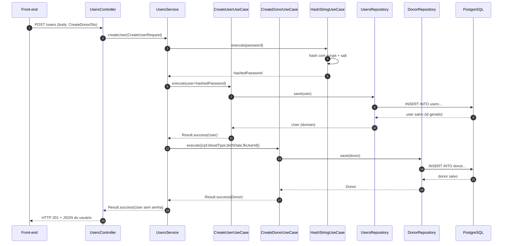
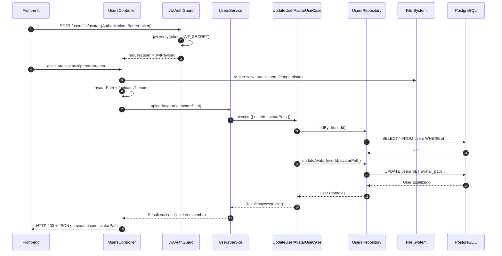

## Users Service – Fluxos Específicos

Este arquivo descreve detalhadamente dois fluxos importantes:

1. Cadastro de doador (`POST /users` com `personType = DONOR`);
2. Upload de avatar (`POST /users/:id/avatar`).

Inclui diagramas de sequência em Mermaid e explicações passo a passo.

---

## 1. Fluxo de cadastro de doador (`POST /users`)

### 1.1 Diagrama de sequência (alto nível)



---

### 1.2 Passo a passo por camada

#### 1.2.1 Cliente → Controller

- **Endpoint**: `POST /users`
- **Body** (exemplo para doador):

```json
{
  "email": "donor@example.com",
  "password": "SecurePassword123!",
  "name": "João Silva",
  "city": "São Paulo",
  "uf": "SP",
  "zipcode": "01310-100",
  "personType": "DONOR",
  "cpf": "123.456.789-00",
  "bloodType": "O+",
  "birthDate": "1990-05-15"
}
```

- O Nest:
  - Mapeia o corpo para o DTO definido (`CreateDonorDto`/`BaseCreateUserDto`);
  - Roda validações `class-validator`:
    - Email válido, senha forte, UF com 2 letras, etc.;
    - Formato de CPF, tipo sanguíneo, data de nascimento;
  - Se alguma validação falha → responde `400` automático.

- Se tudo ok, o `UsersController.createUser` chama:

```ts
const result = await this.usersService.createUser(user);
```

---

#### 1.2.2 Controller → `UsersService.createUser`

No `UsersService`:

1. **Hash da senha**:
   - Chama `hashStringUseCase.execute(user.password ?? '')`;
   - Internamente:
     - `HashRepository.hash` usa `crypto.randomBytes(16)` para gerar salt;
     - `crypto.scryptSync(password, salt, 64)` para derivar o hash;
     - Retorna `"<saltEmHex>:<hashEmHex>"`.
   - Substitui `user.password` pelo hash antes de salvar no banco.

2. **Criação do usuário base**:
   - Chama `CreateUserUseCase.execute(userComSenhaHasheada)`.
   - O caso de uso:
     - Verifica se e-mail já existe via `GetUserByEmailUseCase`;
     - Se já existir → `Result.failure(UserAlreadyExists)`;
     - Se não existir → chama `UserRepositoryPort.save(user)` (TypeORM) e retorna `Result.success(userCriado)`.

3. **Validação de `personType`**:
   - Se `user.personType` não estiver definido, retorna `Result.failure(UserNotFoundError)` (nome do erro está assim no código).

4. **Criação do perfil de doador**:
   - Se `personType === DONOR`, entra no `case PersonType.DONOR`:
     - Monta objeto de domínio `Donor` com:
       - `cpf`, `bloodType`, `birthDate`, `fkUserId = id do usuário criado`;
     - Chama `CreateDonorUseCase.execute(...)`.
   - `CreateDonorUseCase`:
     - Injeta `DonorRepositoryPort`;
     - Chama `donorRepository.save(donor)` (que usa `DonorMapper.toPersistence` e TypeORM);
     - Retorna `Result.success(donorSalvo)`.

5. **Tratamento de falha na criação de donor**:
   - Se `!donor.isSuccess`, o `UsersService` retorna:

     ```ts
     return ResultFactory.partialSuccess(result.value);
     ```

   - Isso significa:
     - Usuário base foi criado;
     - Perfil de doador falhou;
     - Resultado tem `isPartialSuccess: true`.

6. **Remoção da senha antes de retornar**:
   - Quando tudo dá certo:

     ```ts
     delete result.value.password;
     return ResultFactory.success(result.value);
     ```

---

#### 1.2.3 `UsersService` → Controller → Cliente

- No `UsersController.createUser`:
  - Se `!result.isSuccess`:
    - Mapeia `ErrorsEnum` → HTTP (400, 404, etc.).
  - Se `result.isSuccess`:
    - Se `result.isPartialSuccess` → `res.status(206)` (Partial Content).
    - Caso contrário → `res.status(201)` (Created).
    - Retorna `result.value` (usuário sem senha).

O cliente recebe o usuário cadastrado, e, em caso de sucesso parcial, sabe que o perfil específico (DONOR/COMPANY) não foi criado com sucesso.

---

## 2. Fluxo de upload de avatar (`POST /users/:id/avatar`)

### 2.1 Diagrama de sequência



---

### 2.2 Passo a passo por camada

#### 2.2.1 Autenticação via `JwtAuthGuard`

- Endpoint: `POST /users/:id/avatar`.
- Antes do controller, o Nest executa o **`JwtAuthGuard`**:
  - Lê header `Authorization: Bearer <token>`;
  - Usa `jsonwebtoken` + `process.env.JWT_SECRET` para verificar o token;
  - Valida se o payload tem `id`, `email`, `personType`;
  - Em caso de sucesso, coloca `request.user = payload`;
  - Em caso de erro, lança `UnauthorizedException` (token ausente, inválido ou expirado).

---

#### 2.2.2 Upload do arquivo com Multer

No `UsersController.uploadAvatar`:

- Está decorado com:

```ts
@UseInterceptors(
  FileInterceptor('avatar', {
    storage: diskStorage({
      destination: './temp/uploads',
      filename: (_req, file, cb) => { ... },
    }),
    fileFilter: (_req, file, cb) => { ... },
    limits: { fileSize: 5 * 1024 * 1024 }, // 5MB
  }),
)
```

- `FileInterceptor('avatar', ...)`:
  - Lê o campo de arquivo chamado `avatar` no `multipart/form-data`;
  - **Storage**: `diskStorage` salva o arquivo em `./temp/uploads`;
  - `filename`:
    - Gera algo como `avatar-<timestamp>-<random>.<ext>`;
  - `fileFilter`:
    - Aceita apenas `image/jpeg`, `image/png`, `image/jpg`;
  - `limits`:
    - Tamanho máximo de 5MB.

- Se passar pelo interceptor, o parâmetro `@UploadedFile()` recebe algo do tipo:
  - `{ filename: string; mimetype: string; ... }`.

---

#### 2.2.3 Regra de autorização no controller

Ainda em `UsersController.uploadAvatar`:

- Recebe:
  - `@Param('id') id: string`;
  - `@CurrentUser() user: JwtPayload` (payload do JWT do guard);
  - `@UploadedFile() file`.

- Aplica duas verificações:

1. **Usuário só pode alterar o próprio avatar**:

   ```ts
   if (user.id !== id) {
     throw new ForbiddenException('You can only upload your own avatar');
   }
   ```

2. **Arquivo é obrigatório**:

   ```ts
   if (!file) {
     throw new HttpException('No file uploaded', HttpStatus.BAD_REQUEST);
   }
   ```

---

#### 2.2.4 Monta o `avatarPath` público

- O caminho salvo no banco é:

```ts
const avatarPath = `/uploads/${file.filename}`;
```

- Isso é consistente com `main.ts`:

```ts
app.useStaticAssets(join(__dirname, '..', '..', 'temp', 'uploads'), {
  prefix: '/uploads/',
});
```

- Resultado:
  - Arquivo físico: `./temp/uploads/<filename>`;
  - URL pública: `http://<host>:3002/uploads/<filename>`;
  - `avatarPath` pode ser usado diretamente pelo front-end para construir a URL da imagem.

---

#### 2.2.5 Controller → `UsersService.uploadAvatar`

- Chamada:

```ts
const result = await this.usersService.uploadAvatar(id, avatarPath);
```

No `UsersService.uploadAvatar`:

1. Chama `UpdateUserAvatarUseCase.execute({ userId, avatarPath })`.
2. Se `!result.isSuccess`, devolve `Result.failure`.
3. Se sucesso:
   - Remove `password` do usuário:
     ```ts
     delete result.value.password;
     ```
   - Retorna `Result.success(userSemSenha)`.

---

#### 2.2.6 `UpdateUserAvatarUseCase` → `UsersRepository` → DB

- `UpdateUserAvatarUseCase`:

  1. Verifica se o usuário existe:

     ```ts
     const user = await this.usersRepository.findById(input.userId);
     if (!user) {
       return ResultFactory.failure(ErrorsEnum.UserNotFound);
     }
     ```

  2. Atualiza o avatar:

     ```ts
     const updatedUser = await this.usersRepository.updateAvatar(
       input.userId,
       input.avatarPath,
     );
     ```

  3. Se `updatedUser` for `null`:
     - Retorna `Result.failure(ErrorsEnum.UserNotFound)`.
  4. Caso contrário:
     - `Result.success(updatedUser)`.

- `UsersRepository.updateAvatar`:

  1. `findOneBy({ id })` no banco;
  2. Se não achar, retorna `null`;
  3. Se achar:
     - `user.avatarPath = avatarPath`;
     - `save(user)` no TypeORM;
  4. Converte com `UserMapper.toDomain(savedUser)`;
  5. Retorna `User` de domínio com o novo `avatarPath`.

---

#### 2.2.7 Resposta final ao cliente

De volta ao controller:

- Se `!result.isSuccess`:
  - Mapeia erros para HTTP:
    - `UserNotFound` → `404`;
    - Outros → `400`.
- Se `result.isSuccess`:
  - Retorna `200 OK` com `result.value`:
    - Usuário atualizado, sem senha;
    - Campo `avatarPath` preenchido com o caminho `/uploads/...`.

---

## 3. Resumo dos fluxos

- **Cadastro de doador**:
  - Passa por:
    - Validação de DTO;
    - Hash de senha com `scrypt` (`HashModule`);
    - Criação de usuário base (`CreateUserUseCase` + `UsersRepository`);
    - Criação de perfil de doador (`CreateDonorUseCase` + `DonorRepository`);
    - Uso do pattern `Result` para sinalizar sucesso total ou parcial.

- **Upload de avatar**:
  - Usa:
    - Autenticação com `JwtAuthGuard` (JWT + `JWT_SECRET`);
    - Autorização de recurso (`id` do token deve bater com o `id` da rota);
    - Upload físico com Multer (disco local em `./temp/uploads`);
    - Atualização do campo `avatarPath` via `UpdateUserAvatarUseCase` + `UsersRepository`;
    - Exposição pública de arquivos via `app.useStaticAssets` com prefixo `/uploads`.

---

